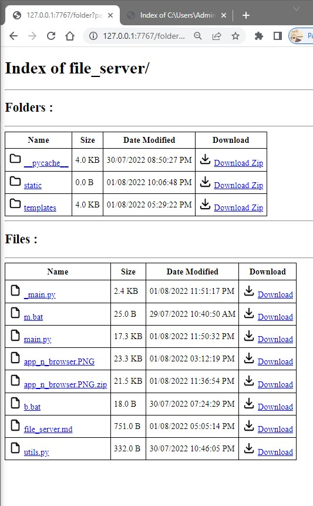
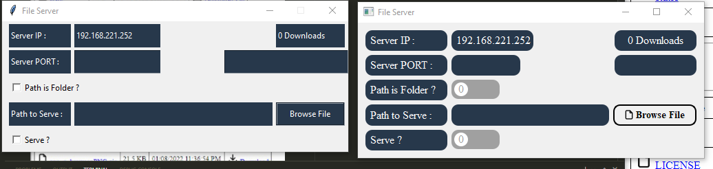

# File Server

Uses [Flask](https://www.palletsprojects.com) and [PySide6](https://www.qt.io/qt-for-python) to serve a file 🗃️ or folder 📁 over HTTP on the specified port.

Once the server is started, you don't need to switch it off to change the path to serve or upload, just change it and the download from that moment will serve the current file 🗃️ or folder 📁.

## Serving folder
---
- the folder directories will be displayed
- if url is /served, folder will be zipped before being served, but if the folder has been zipped already it just sends the zipped file instead.
- if the url contains argument **/served?latest=1**, inasmuch the value is not **[none, 0, false]**, the folder will be zipped before been served.
- it will exclude **\_\_pycache\_\_** folders from the folder given when zipping.

## Scripts
---

- [main.py](main.py) for the running the server in the  terminal.
- [qt_main.py](qt_main.py) for the running the server in the  Qt for Python (PySide6).
- [tk_main.py](tk_main.py) for the running the server in the  tkinter.

left-tkinter, right-Qt